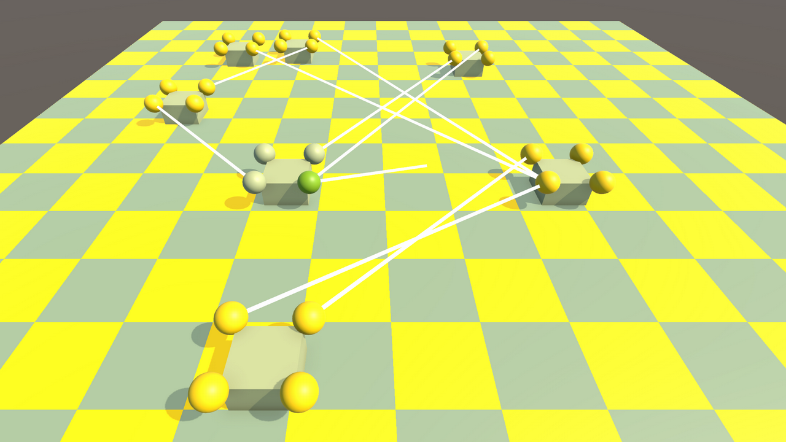

# CrazyPawns
*Это тестовое [задание](#задание) от и для одной компании, правильно отвечающей на главный вопрос!*

## 📌Описание
Интерактивное демо с перемещаемыми фигурами по шахматной доске, допускающими соединения между своими частями и удаления с доски, с базовыми визуальными эффектами действий игрока и управляемой камерой.

### ✅Реализованы:
- Всё управление всем через ***Input System*** в префабе игрока.
- Управление камерой: панорамирование в плоскости Y = 0; приближение в позицию курсора и отдаление от позиции курсора.
- Создание плоской шахматной доски по параметрам: количество клеток на сторону, размер клетки, цвета *"белых"* и *"чёрных"* клеток.
- Создание и размещение фигур в определённой области на доске: в круге заданного радиуса с использованием пула фигур.
- Сглаженное перемещение фигуры при её перетаскивании мышью.
- Проверка выхода фигуры за границы доски.
- Удаление фигуры при оставлении её за пределами доски.
- Неограниченное соединение шароконнекторов между собой (за исключением случаев повторного соединения и соединения между шароконнекторами одной и той же фигуры) линиями связи с использованием пула линий связи.
- Соединение двух шароконнекторов за раз двумя способами: перетаскиванием линии связи или последовательным кликом от одного коннектора на другой.
- Настраиваемая ширина линии связи в ***Инспекторе*** (до запуска игры).
- Базовые визуальные эффекты: выбранный шароконнектор, активные шароконнекторы, основание фигуры выбрано, фигура помечена к удалению.
- Переключатель на *"ручные"* фигуры в ***SceneData***: набор фиксированных фигур для тестов вместо случайно распределённых.

### ❌Не реализовано:
- Всё остальное, что не требовалось реализовать.

### 🎮Управление
| Действие | Клавиши/мышь |
|----------|--------------|
| Переместить фигуру | Зажать **ЛКМ** на теле фигуры и перемещать ***мышь*** |
| Начать соединение | Кликнуть **ЛКМ** по коннектору или начать **перетаскивание с зажатой ЛКМ** от коннектора |
| Завершить соединение | Кликнуть **ЛКМ** по целевому коннектору или отпустить **перетаскивание мышью с зажатой ЛКМ** на целевом коннекторе |
| Прервать соединение | Кликнуть **ЛКМ** не по целевому коннектору или отпустить **перетаскивание мышью с зажатой ЛКМ** не на целевом коннекторе |
| Удалить фигуру | Переместить фигуру за пределы доски и отпустить |
| Перемещение камеры |  Зажать **ЛКМ** на пустом месте и перемещать ***мышь*** - панорамирование; покрутить **колёсико** в любой момент - приближение **к** курсору, отдаление **от** курсора |

### 🛠Архитектура
- **GameObject / MonoBehaviour** - классический подход разработки в Unity.
- **DI** - Extenject (Zenject), инжекция в методы и конструкторы, фабрики и пулы.
- **События** - event UnityAction.
- **UniTask** - асинхронность (ограниченно ввиду специфики задачи).
- **SOLID**, **YAGNI** - старался держать себя в руках как мог! 😁

## ⚙️Настройка и запуск
0. Скачать проект.
1. Открыть проект в Unity.
2. Открыть сцену `Assets/_Main/Scenes/PawnField`.
3. *(Необязательно)* Найти общие параметры игры в `Assets/_Main/Prefabs/Data/DefaultSettings`.
4. Запустить сцену.     

### 📂Структура проекта
Проект содержит кучу папок и классов. В основном логика следующая:

Система (**Main**) 
  -> Подсистемы (**Common**, **Gameplay**, **Infrastructure**, **Prefabs**, и т.д.) 
    -> Модули (**Pawns**, **Players**, **Pools**, **Controls**, и т.д.)
      -> Функциональные Блоки

## 📦Требования и зависимости

| Инструмент | Версия |
|------------|-------------------|
| Unity | 2022.3.15f1 |
| Visual Studio | 2022 |
| [UniTask](https://github.com/Cysharp/UniTask) | 2.5.11 |
| [Extenject (Zenject)](https://github.com/Mathijs-Bakker/Extenject) | 9.2.0 |

## 📋Задание
Оригинальный текст ТЗ: [TASK.md](TASK.md)

*Репозиторий создан в рамках выполнения тестового задания. Все права на оригинальную формулировку задачи принадлежат компании-заказчику.*

## 👤Контакты
**Олег Т.**
- [Telegram](https://t.me/enedwait)
- [Email](mailto:okrt.xyz@gmail.com)
- [GitHub](https://github.com/Enedwait)
